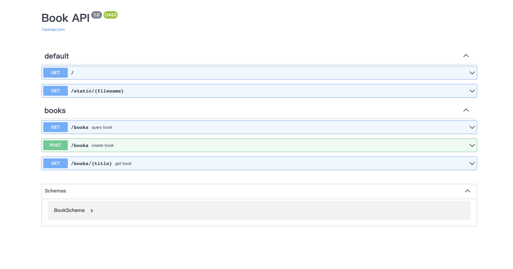

# Flask-Lan


[](https://codecov.io/gh/ischaojie/flask-lan)
[](https://pypi.org/project/Flask-Lan/)


Modernized Flask API builder with schema validator and OpenAPI.

!!!Warning
    Currently, `Flask-Lan` is still under active development(before v1.0.0).

    Be careful of use it in production.

Flask-Lan is kind of like the famous library [FastAPI](https://github.com/tiangolo/fastapi), bringing part of its brilliant features to your Flask application, you can see a lot of similarities between the two.

For example, it uses [Pydantic](https://github.com/samuelcolvin/pydantic) for request and response validation,
it will auto-generate `OpenAPI` API docs and so on.

## Feature

-   Intuitive and easy to use.
-   Request/Response validation based on type hinting(by Pydantic).
-   Auto-generated `OpenAPI` docs(both swagger and redoc).
-   Designed for API development.

## Quick start

First install it with:

```bash
python -m pip install Flask-Lan
```

Flask-Lan does not affect your existing routed views, you just need to use `@api` decorators in each view. For a simple example:

```python
from flask import Flask
from flask_lan import Lan, api

app = FLask(__name__)

Lan(app, "Dogs API")

@app.get("/dogs")
@api
def get_dogs():
    return {"dogs": "🐶"}

if __name__ == "__main__":
    app.run(debug=True)
```

The `@api` decorator helps you do a lot of work by distinguishing whether the requested data is Path, Query or Body type data, and then validating that data (to borrow from the power of `pydantic`), as well as automatically generating API documentation.

Then open [http://127.0.0.1:5000/docs](http://127.0.0.1:5000/docs) you will see the API docs like this:



If you prefer redoc-style documentation, just visit [http://127.0.0.1:5000/redoc](http://127.0.0.1:5000/redoc), as you used in FastAPI.

There are many other features of `@api`, visit [API Decorator](api.md) for more details.

## License

This project is licensed under the terms of the MIT license.
